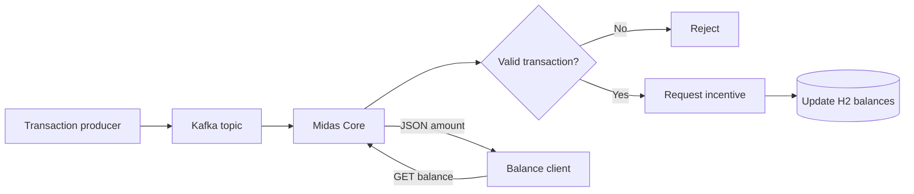
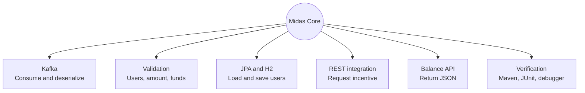
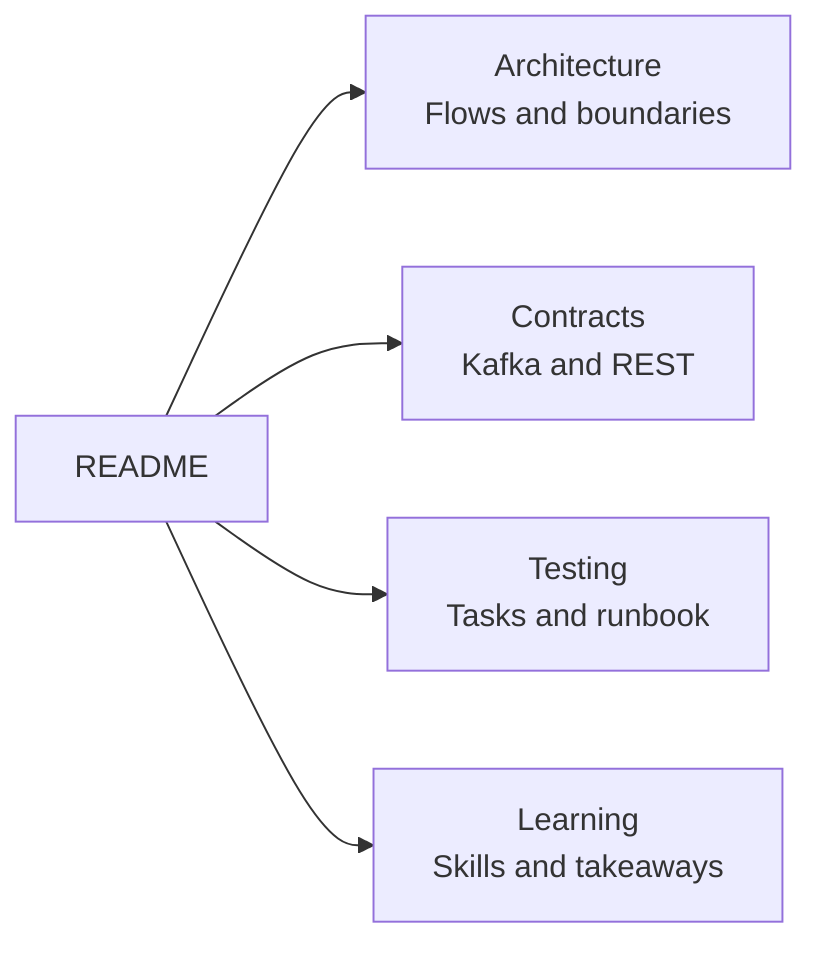
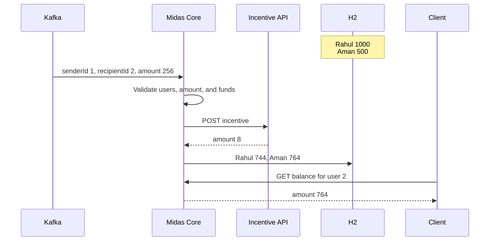
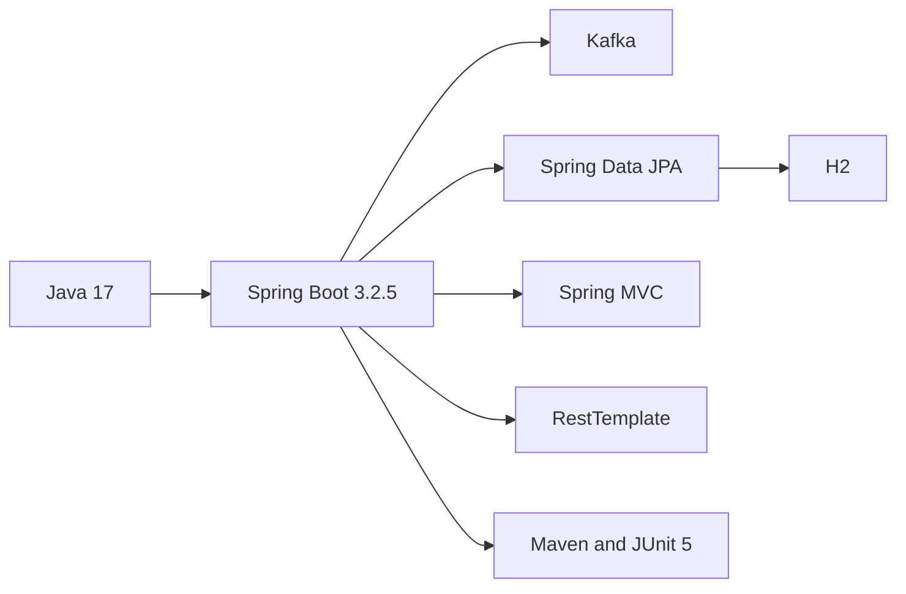
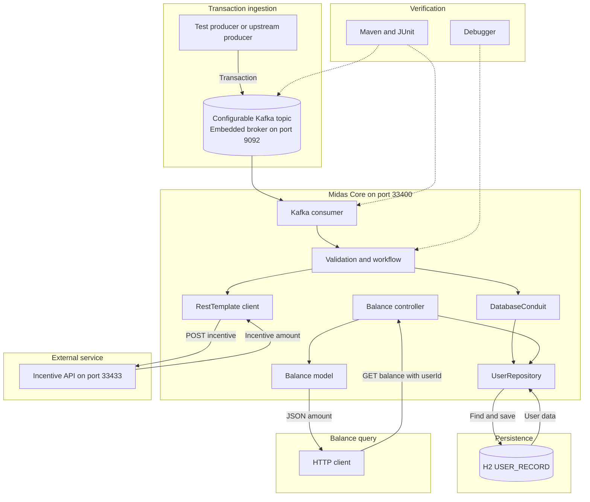

[View completion certificate](https://www.theforage.com/completion-certificates/Sj7temL583QAYpHXD/E6McHJDKsQYh79moz_Sj7temL583QAYpHXD_694d2801f76d215bcf3b3a4b_1766844198237_completion_certificate.pdf)

# Midas Core

> A Kafka-driven bank-transfer microservice from the JPMorgan Chase & Co. Advanced Software Engineering job simulation on Forage.



## What the system covers



## Documentation map



| Open | Focus |
|---|---|
| [Architecture](docs/architecture.md) | Processing, validation, domain model, example |
| [API contracts](docs/api-contracts.md) | Payloads, endpoints, response fields, ports |
| [Testing](docs/testing-and-runbook.md) | Embedded Kafka, task suites, commands |
| [What I learned](docs/what-i-learned.md) | New concepts and production lessons |

## One transaction



```text
Rahul: 1000 - 256     = 744
Aman:   500 + 256 + 8 = 764
```

`256` is used because the bundled API awards `log₂(amount)` for whole-number powers of two. [See the verified example →](docs/architecture.md#complete-application-example)

## Stack



> [!IMPORTANT]
> The current `flow` branch is the task scaffold. It contains the models, repository, database conduit, tests, fixtures, and Incentive API JAR. The consumer, controller, incentive client, dependencies, and runtime configuration shown in the intended architecture are not checked into this branch.

<details>
<summary><strong>View complete system design</strong></summary>



</details>
