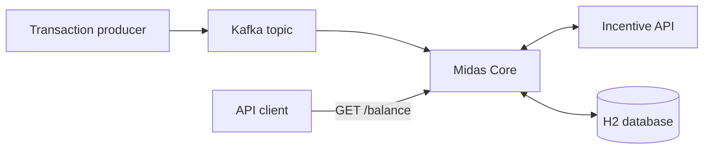
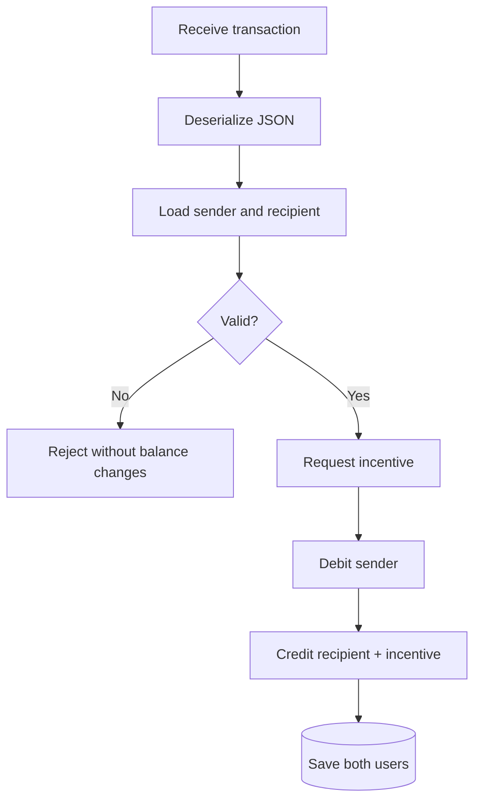
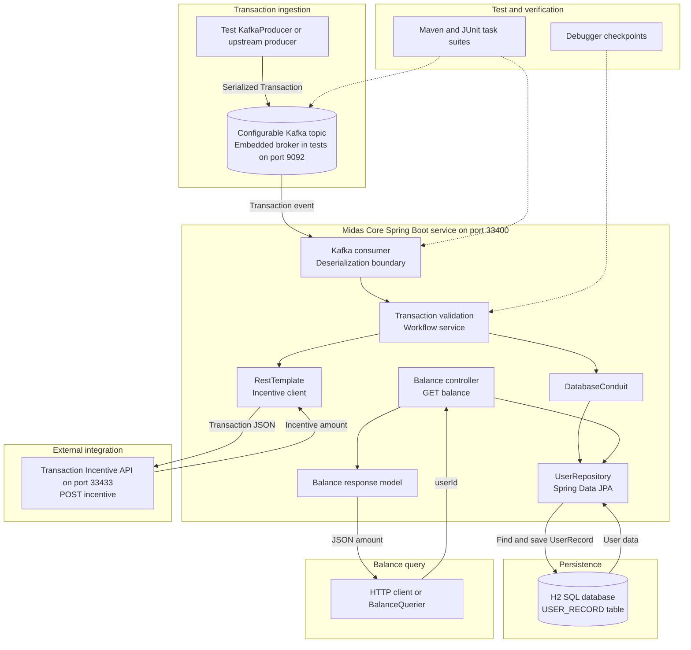

[View completion certificate](https://www.theforage.com/completion-certificates/Sj7temL583QAYpHXD/E6McHJDKsQYh79moz_Sj7temL583QAYpHXD_694d2801f76d215bcf3b3a4b_1766844198237_completion_certificate.pdf)

# Midas Core

> A transaction-processing microservice from the JPMorgan Chase & Co. Advanced Software Engineering job simulation on Forage.

Think of Midas Core as a digital bank-transfer system: a transaction arrives through Kafka, the service validates it, requests an incentive, updates the sender and recipient records, and makes the resulting balance available through an HTTP endpoint.

## Core capabilities

| Area | Responsibility |
|---|---|
| Kafka | Consume and deserialize transaction messages from a configurable topic |
| Validation | Verify both users, a positive amount, and sufficient sender funds |
| Persistence | Model and update relational `UserRecord` data with Spring Data JPA and H2 |
| Integration | Call the external Incentive API with `RestTemplate` |
| REST | Return a user's balance as JSON through `GET /balance` |
| Verification | Exercise the workflow with Maven, JUnit, embedded Kafka, and debugger inspection |

## Documentation

| Guide | Contents |
|---|---|
| [Architecture and transaction flow](docs/architecture.md) | Components, boundaries, validation path, domain model, worked example, and complete system design |
| [Message and API contracts](docs/api-contracts.md) | Kafka payload, Incentive API, balance endpoint, ports, and verified field names |
| [Testing and local runbook](docs/testing-and-runbook.md) | Task suites, fixtures, embedded Kafka, commands, and repository structure |
| [What I learned](docs/what-i-learned.md) | New concepts and practical engineering lessons from the project |

## Technology stack

`Java 17` · `Spring Boot 3.2.5` · `Apache Kafka` · `Spring Data JPA` · `H2` · `Spring MVC` · `RestTemplate` · `Maven` · `JUnit 5`

## Transaction at a glance

### Example result

| Stage | Rahul — ID 1 | Aman — ID 2 |
|---|---:|---:|
| Initial balance | ₹1,000 | ₹500 |
| Transfer | −₹256 | +₹256 |
| Incentive | — | +₹8 |
| Final balance | **₹744** | **₹764** |

The amount `256` is used because the bundled service returns `log₂(amount)` for whole-number powers of two. See the [complete walkthrough](docs/architecture.md#complete-application-example).

## Repository snapshot

> [!IMPORTANT]
> The current `flow` branch is the supplied task scaffold. It contains the application entry point, models, JPA repository and conduit, test fixtures and helpers, and the bundled Incentive API. The Kafka consumer, balance controller, incentive client, Maven dependencies, and runtime configuration described by the task architecture are not checked into this branch. The documentation distinguishes this intended completed flow from the code currently present.

<strong>View complete system design</strong>

