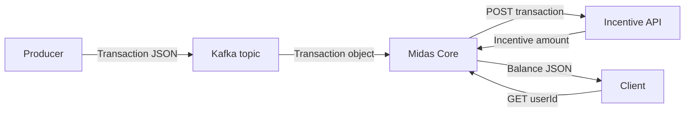
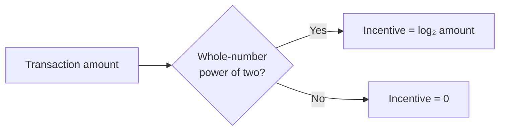

# Message and API contracts

[← Back to README](../README.md) · [Architecture](architecture.md) · [Testing](testing-and-runbook.md) · [What I learned](what-i-learned.md)

## Contract map



## Kafka transaction

```json
{
  "senderId": 1,
  "recipientId": 2,
  "amount": 256
}
```

| Field | Java type | Meaning |
|---|---:|---|
| `senderId` | `long` | User sending funds |
| `recipientId` | `long` | User receiving funds |
| `amount` | `float` | Transfer amount |

> The checked-in `Transaction` class uses `recipientId`, not `receiverId`.

## Incentive API

```http
POST http://localhost:33433/incentive
Content-Type: application/json
```

Request:

```json
{
  "senderId": 1,
  "recipientId": 2,
  "amount": 256
}
```

Response:

```json
{
  "amount": 8
}
```

The bundled JAR exposes `POST /incentive`. Its response property is `amount`, not `incentive`.

### Incentive rule



| Transfer amount | Incentive |
|---:|---:|
| `128` | `7` |
| `200` | `0` |
| `256` | `8` |

## Balance API

```http
GET http://localhost:33400/balance?userId=2
```

Response model:

```json
{
  "amount": 764
}
```

The checked-in `Balance` model contains only `amount`; it does not contain a `userId` or `balance` property.

## Local ports

| Port | Service |
|---:|---|
| `9092` | Embedded Kafka broker used by Tasks 2–5 |
| `33400` | Midas Core server expected by `BalanceQuerier` |
| `33433` | Bundled Incentive API |
