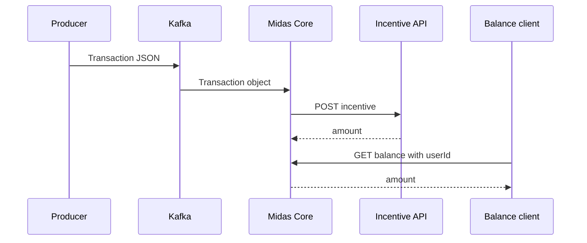
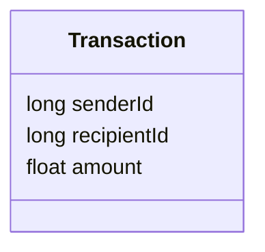
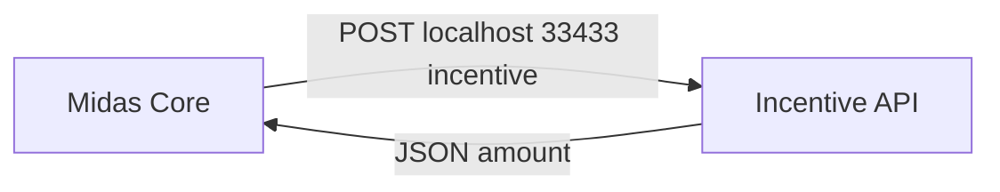
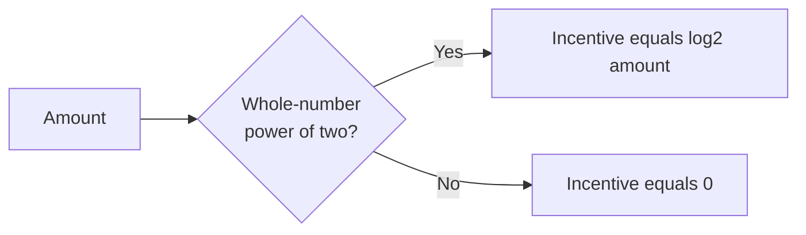
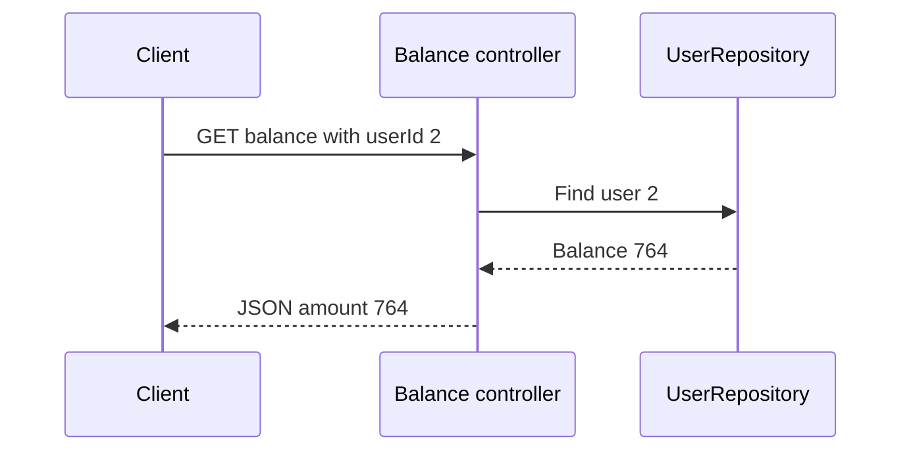
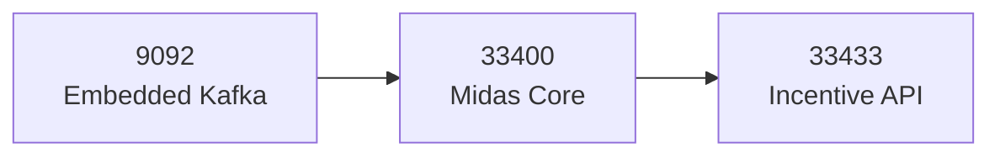

# Message and API contracts

[← README](../README.md) · [Architecture](architecture.md) · [Testing](testing-and-runbook.md) · [Learning](what-i-learned.md)

## Contract flow



## Kafka message

```json
{
  "senderId": 1,
  "recipientId": 2,
  "amount": 256
}
```



> The model uses `recipientId`, not `receiverId`.

## Incentive endpoint



```json
{
  "amount": 8
}
```



| Amount | Incentive |
|---:|---:|
| `128` | `7` |
| `200` | `0` |
| `256` | `8` |

> The response field is `amount`, not `incentive`.

## Balance endpoint



```json
{
  "amount": 764
}
```

> `Balance` contains only `amount`.

## Ports


