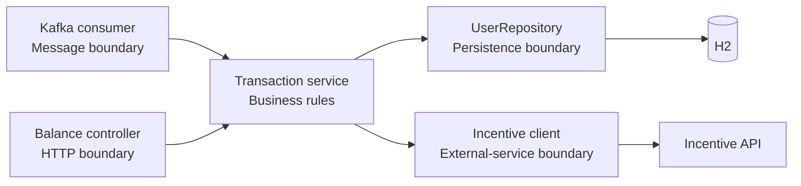
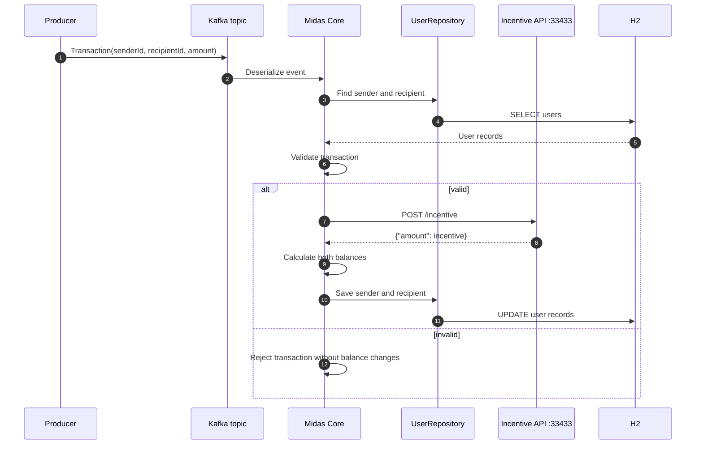
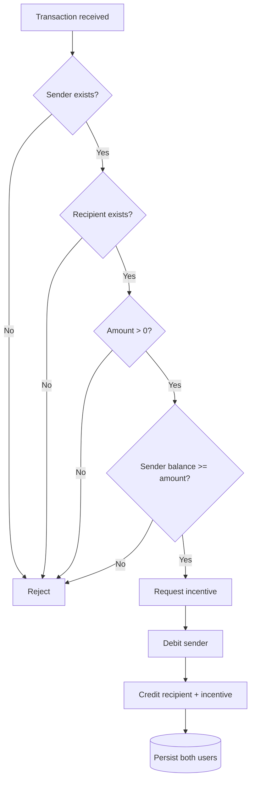
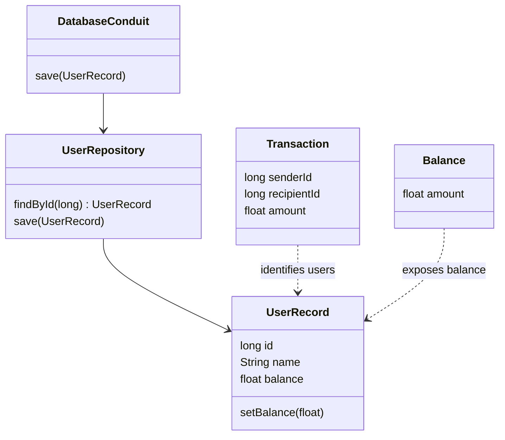
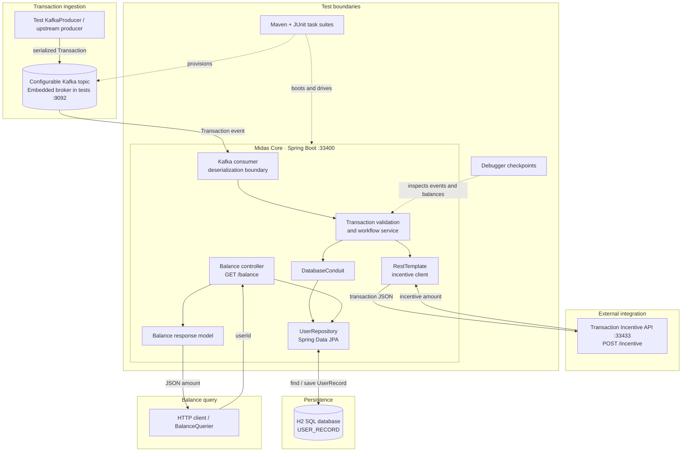

# Architecture and transaction flow

[← Back to README](../README.md) · [API contracts](api-contracts.md) · [Testing](testing-and-runbook.md) · [What I learned](what-i-learned.md)

## Architectural boundaries



| Layer | Owns | Does not own |
|---|---|---|
| Kafka consumer | Message receipt and deserialization | Balance calculations or SQL |
| Transaction service | Validation, incentive orchestration, and balance updates | Kafka configuration or HTTP routing |
| Repository | Loading and saving users | Business validation |
| Incentive client | External HTTP request/response | Database updates |
| Balance controller | Query parameters and JSON responses | Transaction processing |

This separation keeps transport, business rules, persistence, and integrations independently understandable and testable.

## End-to-end processing



## Validation path



## Domain model



| `UserRecord` field | Type | Database rule |
|---|---:|---|
| `id` | `long` | Generated primary key |
| `name` | `String` | Not null |
| `balance` | `float` | Not null |

## Complete application example

### 1. Initial database

| ID | User | Balance |
|---:|---|---:|
| `1` | Rahul | ₹1,000 |
| `2` | Aman | ₹500 |

### 2. Kafka receives

```json
{
  "senderId": 1,
  "recipientId": 2,
  "amount": 256
}
```

The JSON is deserialized into a `Transaction`. The service loads both `UserRecord` objects and checks:

```text
Rahul exists                 ✓
Aman exists                  ✓
Amount is positive           ✓
Rahul has sufficient funds   ✓
```

### 3. Incentive API responds

```json
{
  "amount": 8
}
```

### 4. Balances are calculated

```text
Rahul: 1,000 − 256     = 744
Aman:    500 + 256 + 8 = 764
```

Both records are saved. A later request to `GET /balance?userId=2` returns:

```json
{
  "amount": 764
}
```

> The original ₹200 example would receive an incentive of `0` from the bundled API. `256` produces `8`, so this example demonstrates the complete incentive path accurately.

## Complete system design


