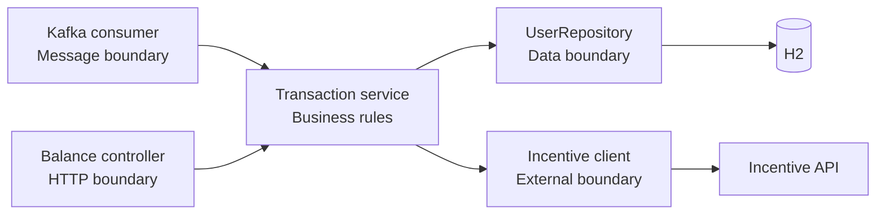
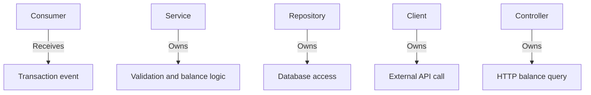
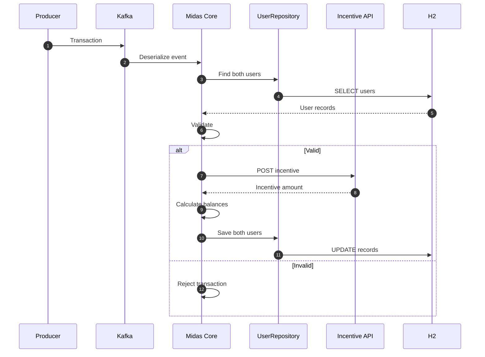
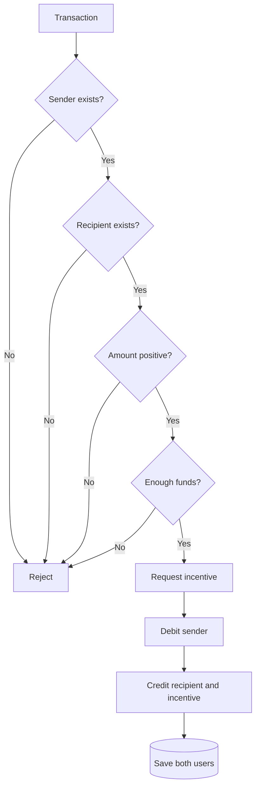
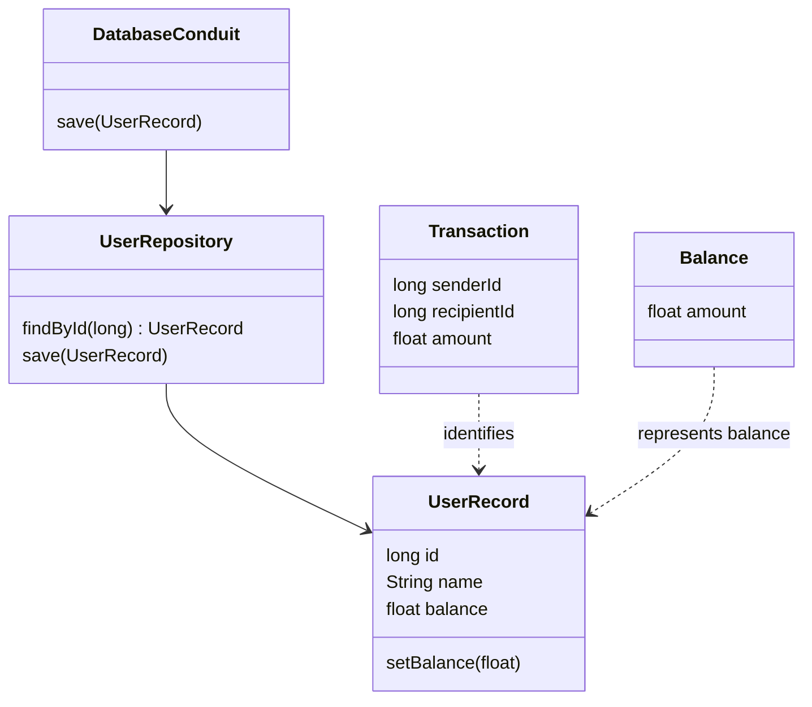
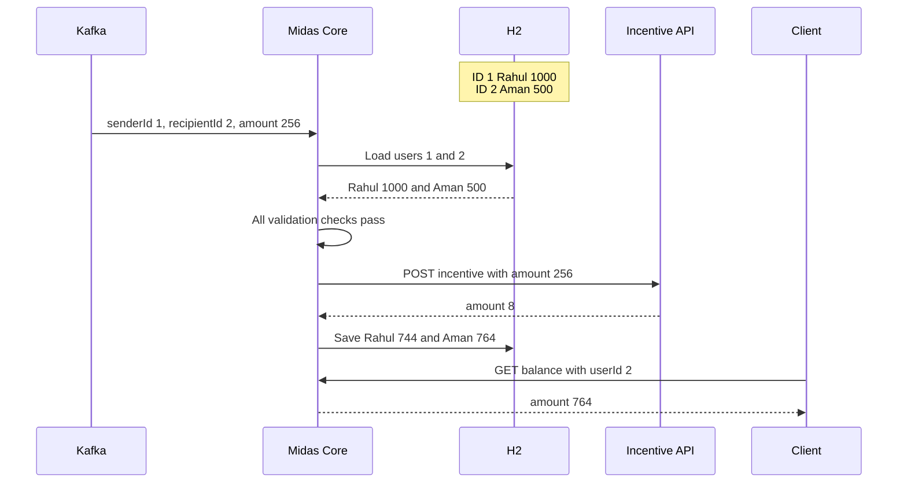

# Architecture and transaction flow

[← README](../README.md) · [Contracts](api-contracts.md) · [Testing](testing-and-runbook.md) · [Learning](what-i-learned.md)

## Boundaries

Each boundary owns one concern, keeping transport code separate from business logic and persistence.





## Processing sequence

Transactions move asynchronously from the producer to Kafka before validation and persistence begin.



## Validation gate

Every check must pass before the incentive is requested or either user balance is changed.



## Domain model

The core models represent incoming transfers, stored users, balance responses, and repository access.



## Complete application example

The example uses an amount of `256` so the bundled Incentive API returns a visible reward of `8`.



```text
Sender:    1000 - 256     = 744
Recipient:  500 + 256 + 8 = 764
```

> `200` receives no reward from the bundled API. `256` produces an incentive of `8`, so the diagram shows the complete path accurately.
