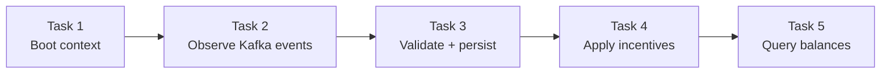
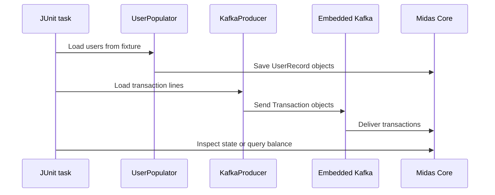
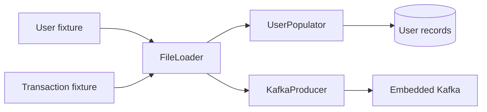

# Testing and local runbook

[← Back to README](../README.md) · [Architecture](architecture.md) · [API contracts](api-contracts.md) · [What I learned](what-i-learned.md)

## Test journey



| Suite | What it drives | Verification style |
|---|---|---|
| `TaskOneTests` | Spring application startup | Maven/JUnit output |
| `TaskTwoTests` | Transactions through embedded Kafka | Debugger inspection |
| `TaskThreeTests` | User population and transaction processing | Inspect Waldorf's balance |
| `TaskFourTests` | Incentive-aware processing | Inspect Wilbur's balance |
| `TaskFiveTests` | End-to-end balance requests on port `33400` | JSON-derived `Balance` output |

Tasks 2–4 deliberately stay alive so state can be inspected in a debugger. Stop each test after recording the requested result.

## Embedded Kafka test flow



## Run locally

```bash
# Terminal 1 — external incentive service
java -jar services/transaction-incentive-api.jar

# Terminal 2 — run one task at a time
./mvnw test -Dtest=TaskOneTests
./mvnw test -Dtest=TaskTwoTests
./mvnw test -Dtest=TaskThreeTests
./mvnw test -Dtest=TaskFourTests
./mvnw test -Dtest=TaskFiveTests
```

> [!NOTE]
> The current scaffold's `pom.xml` has no dependencies and `application.yml` is empty. The full suite requires the task's Spring Web, Spring Kafka, Spring Data JPA, H2, and test dependencies, along with Kafka, topic, and server configuration.

## Repository structure

```text
forage-midas/
├── docs/
│   ├── api-contracts.md
│   ├── architecture.md
│   ├── testing-and-runbook.md
│   └── what-i-learned.md
├── services/
│   └── transaction-incentive-api.jar
├── src/
│   ├── main/java/com/jpmc/midascore/
│   │   ├── MidasCoreApplication.java
│   │   ├── component/DatabaseConduit.java
│   │   ├── entity/UserRecord.java
│   │   ├── foundation/Balance.java
│   │   ├── foundation/Transaction.java
│   │   └── repository/UserRepository.java
│   └── test/
│       ├── java/com/jpmc/midascore/     # Five tasks and helpers
│       └── resources/test_data/         # User and transaction fixtures
├── application.yml
├── pom.xml
└── README.md
```

## How the fixtures are used


