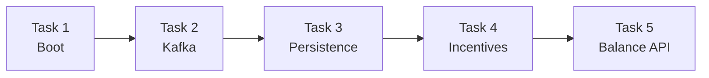
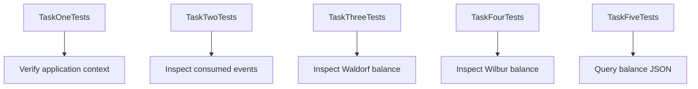
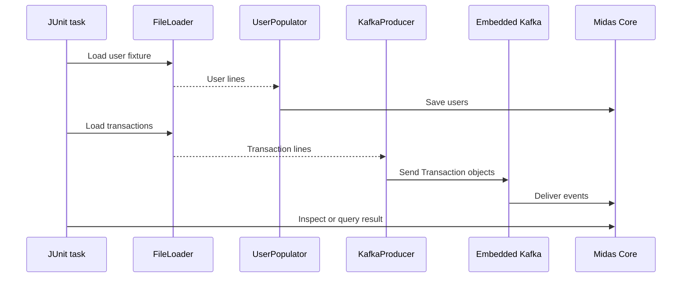
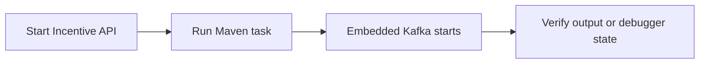

# Testing and local runbook

[← README](../README.md) · [Architecture](architecture.md) · [Contracts](api-contracts.md) · [Learning](what-i-learned.md)

## Task journey





## Embedded Kafka flow



> Tasks 2–4 stay alive for debugger inspection. Stop them after recording the requested state.

## Run

```bash
# Terminal 1
java -jar services/transaction-incentive-api.jar

# Terminal 2 — select one task
./mvnw test -Dtest=TaskOneTests
./mvnw test -Dtest=TaskTwoTests
./mvnw test -Dtest=TaskThreeTests
./mvnw test -Dtest=TaskFourTests
./mvnw test -Dtest=TaskFiveTests
```



> [!NOTE]
> The current scaffold has an empty dependency list and configuration file. The complete suite needs Spring Web, Kafka, Data JPA, H2, test dependencies, and runtime settings.

## Repository map

```text
forage-midas/
├── docs/                  # Linked documentation
├── services/              # Incentive API JAR
├── src/main/
│   └── java/.../midascore
│       ├── component/     # Database conduit
│       ├── entity/        # UserRecord
│       ├── foundation/    # Transaction and Balance
│       └── repository/    # UserRepository
├── src/test/              # Five tasks, helpers, fixtures
├── application.yml
└── pom.xml
```
