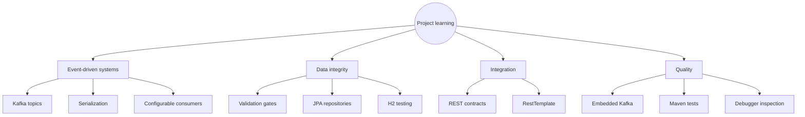
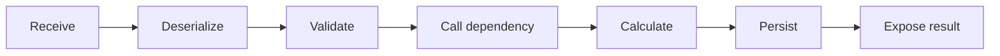
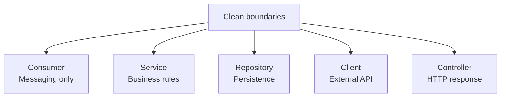
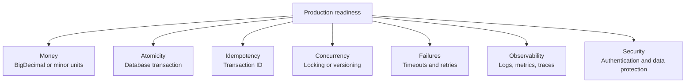

# What I learned

[← README](../README.md) · [Architecture](architecture.md) · [Contracts](api-contracts.md) · [Testing](testing-and-runbook.md)

The project connected event-driven processing, relational persistence, REST integration, and testing in one practical workflow.

## Workflow lessons

The order of operations protects data integrity and makes the transaction lifecycle easier to reason about.

## Key takeaways

| Learned | Why it matters |
|---|---|
| Validate before mutation | Prevents invalid or partial balance changes |
| Match contracts exactly | `recipientId` and `amount` must deserialize correctly |
| Externalize configuration | Topics and URLs can change by environment |
| Test real boundaries | Embedded Kafka verifies asynchronous ingestion |
| Debug asynchronous state | Events run outside the producer call stack |

## Production next steps

Moving from an exercise to a financial production service would require stronger consistency, resilience, security, and observability.

