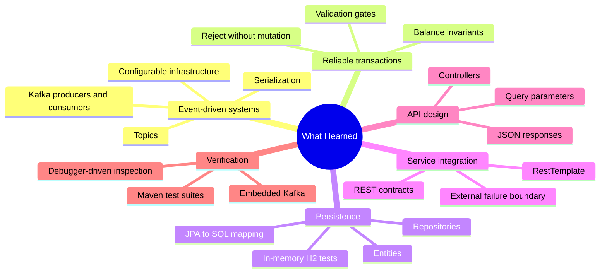
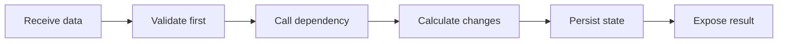

# What I learned

[← Back to README](../README.md) · [Architecture](architecture.md) · [API contracts](api-contracts.md) · [Testing](testing-and-runbook.md)

This project connected concepts that are often learned separately—messaging, business validation, persistence, external APIs, and HTTP delivery—into one transaction workflow.

## New concepts put into practice

| Concept | What became clear |
|---|---|
| Event-driven processing | A producer does not call the transaction logic directly; it publishes an event and the Kafka consumer processes it asynchronously |
| Serialization boundaries | Kafka JSON must be deserialized into the exact Java contract before business logic can safely use it |
| Externalized configuration | Topic names and service addresses belong in configuration so test and runtime environments can change independently |
| Validation before mutation | User existence, positive amount, and sufficient funds must all be confirmed before either balance changes |
| Repository abstraction | Spring Data repositories express persistence operations in Java while JPA handles the relational mapping |
| Service orchestration | One transaction can cross messaging, database, and REST boundaries while the service layer keeps the workflow coherent |
| Contract accuracy | Small naming differences—such as `recipientId` versus `receiverId`—can break deserialization or API integration |
| Integration testing | Embedded Kafka tests the real messaging boundary without requiring a permanently installed broker |
| Debugging asynchronous code | Breakpoints and state inspection help trace messages whose processing does not happen on the producer's call stack |

## The most important engineering lesson

Correct transaction processing depends as much on operation order as on individual calculations. Loading and validating both users before changing state prevents partial or invalid updates. Keeping the Kafka listener, service logic, repository, external client, and controller separate makes that order visible and maintainable.

## Practical takeaways

- I learned how Kafka decouples transaction producers from consumers and why configurable topics matter across environments.

- I learned how Spring converts JSON messages and HTTP responses into typed Java objects.

- I learned how entity modeling, repositories, and H2 work together to represent and test relational balance data.

- I learned to treat an external REST API as a separate contract and failure boundary in the workflow.

- I learned how clean architectural boundaries keep transport code separate from validation and persistence rules.

- I learned to combine automated Maven tests with debugger inspection when verifying asynchronous processing and database state.

## Production-minded follow-ups

The exercise also highlighted improvements a production money-transfer service would need:

| Concern | Production direction |
|---|---|
| Money precision | Replace `float` with `BigDecimal` or integer minor units |
| Atomic updates | Wrap sender and recipient changes in one database transaction |
| Duplicate Kafka delivery | Add idempotency using a transaction identifier |
| Concurrent transfers | Use appropriate locking or optimistic versioning |
| External API failure | Add timeouts, retries, circuit breaking, and a defined fallback policy |
| Invalid events | Add structured errors, metrics, and a dead-letter topic |
| Observability | Add correlation IDs, logs, metrics, and distributed traces |
| Security | Authenticate APIs and protect sensitive financial data |
